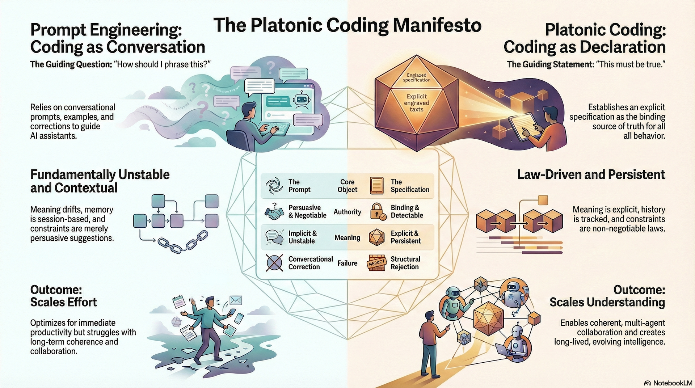

# Platonic Coding Skills

A professional collection of Agent Skills for AI-powered [Platonic Coding](https://www.xiaming.site/2026/02/06/platonic-coding/) workflow.

[](https://opensource.org/licenses/MIT)
[](https://agentskills.io)

## Overview

**Platonic Coding** is a coding style designed for complex projects and cross-team collaboration with AI agents. Instead of relying on prompts, vibes, or implicit assumptions, it treats specifications as abstract laws that define what can exist, what can change, and what must always hold. Agents operate inside a shared, closed spec world where meaning is explicit, violations are detectable, and evolution is traceable over time, making large systems reproducible, reviewable, and stable across teams, agents, and long development cycles.



See a full description in [Manifesto](https://github.com/caesar0301/platonic-coding-skills/blob/main/MANIFESTO.md).

## Available Skills

All skills follow the [Agent Skills specification](https://agentskills.io/specification) for maximum compatibility across AI coding agents.

| Skill | Purpose | Docs |
|-------|---------|------|
| 🚀 **platonic-init** | Bootstrap new projects or adopt Platonic Coding for existing codebases. Scaffolds `.platonic.yml`, specs infrastructure, and recovers design specs as Draft RFCs. | [SKILL.md](skills/platonic-init/SKILL.md) |
| 📋 **platonic-specs** | Validate and manage RFC specifications — refine, generate index/history/terminology, check consistency and taxonomy compliance. *(For initialization, use platonic-init.)* | [SKILL.md](skills/platonic-specs/SKILL.md) |
| 📐 **platonic-impl** | Translate RFC specs into concrete implementation guides, then implement code with unit and integration tests. Manages the full spec-to-code pipeline with user confirmation gates. | [SKILL.md](skills/platonic-impl/SKILL.md) |
| ✅ **platonic-code-review** | Review code against specs for consistency, completeness, and gaps. Generates compliance reports (report-only by default). | [SKILL.md](skills/platonic-code-review/SKILL.md) |
| 🔄 **platonic-workflow** | Orchestrate the full four-phase workflow: design draft → RFC → implementation (guide + code) → review, with clear phase visibility and skill handoffs. | [SKILL.md](skills/platonic-workflow/SKILL.md) |

## Installation

### Method 1: Claude Code CLI Marketplace (Easiest)

If using Claude Code CLI with marketplace support:

```bash
# Add the skills marketplace
claude-code marketplace add caesar0301/platonic-coding-skills
```

### Method 2: Install using npx skills (Recommended for Most)

```bash
npx skills add caesar0301/platonic-coding-skills
```

### Method 3: Clone to Skills Directory

Clone this repository to your agent's skills directory:

```bash
git clone https://github.com/caesar0301/platonic-coding-skills.git ~/.claude/skills/platonic-coding-skills
```

## General Workflow

Platonic Coding follows a **four-phase, closed-world workflow** with an initialization step. Meaning is progressively *constrained*, *materialized*, and *verified* as the system moves from abstract intent to concrete code.

```
┌──────────────────────────────────────────────────────────────┐
│ Init: Project Bootstrap (platonic-init)                      │
│                                                              │
│  • Set up .platonic.yml, docs/specs/, docs/impl/, docs/drafts/    │
│  • For existing codebases: scan, plan, and recover           │
│    design specs as Draft RFCs                                │
│                                                              │
│  Output: Platonic Coding infrastructure (+ recovered RFCs)   │
│  Skill:  platonic-init                                       │
└───────────────┬──────────────────────────────────────────────┘
                │
                ▼
┌──────────────────────────────────────────────────────────────┐
│ Phase 0: Conceptual Design & Requirements Elicitation        │
│                                                              │
│  • Clarify problem space, goals, constraints, and invariants │
│  • Explore domain knowledge and prior art                    │
│  • Identify core abstractions and system boundaries          │
│  • Resolve ambiguity before formalization                    │
│                                                              │
│  Output: Shared mental model, requirement notes, concepts    │
│  Tooling: AI with strong logic + broad knowledge (human-led) │
└───────────────┬──────────────────────────────────────────────┘
                │
                ▼
┌──────────────────────────────────────────────────────────────┐
│ Phase 1: Design Specifications (RFC World Construction)      │
│                                                              │
│  • Formalize requirements as RFCs                            │
│  • Define entities, relations, invariants, and constraints   │
│  • Establish terminology, taxonomy, and evolution rules      │
│  • Create a closed, legally-defined specification space      │
│                                                              │
│  Output: RFCs, index, history, terminology                   │
│  Skill:  platonic-specs                                      │
└───────────────┬──────────────────────────────────────────────┘
                │
                ▼
┌──────────────────────────────────────────────────────────────┐
│ Phase 2: Implementation (Guide + Code)                       │
│                                                              │
│  • Translate RFCs into implementation-ready architecture     │
│  • Design impl guide with types, interfaces, module layout   │
│  • Generate coding plan with file-level task breakdown       │
│  • Write code strictly following guide and RFCs              │
│  • Include unit and integration tests                        │
│  • User confirmation gates after guide and coding plan       │
│                                                              │
│  Output: Implementation guide + source code + tests          │
│  Skill:  platonic-impl                                       │
└───────────────┬──────────────────────────────────────────────┘
                │
                ▼
┌──────────────────────────────────────────────────────────────┐
│ Phase 3: Spec Compliance Review (Reality Check)              │
│                                                              │
│  • Verify code against RFCs and implementation guides        │
│  • Detect gaps, drift, and contradictions                    │
│  • Identify specs without code and code without specs        │
│  • Produce traceable compliance reports                      │
│                                                              │
│  Output: Review & compliance reports                         │
│  Skill:  platonic-code-review                                │
└──────────────────────────────────────────────────────────────┘
```

## Examples

Examples are ordered by the general workflow: init → specs → impl → review. Each shows a single skill in action.

### Example 0: Initialize a new project (platonic-init)

```
Use platonic-init to set up Platonic Coding for my new project "Acme".
Language is TypeScript, framework is Next.js. Specs go in docs/specs/.
```

**Result:** `.platonic.yml` config, `docs/specs/` directory with RFC infrastructure and templates, `docs/impl/` and `docs/drafts/` directories.

### Example 1: Adopt Platonic Coding for an existing codebase (platonic-init)

```
Use platonic-init to recover design specs for this existing project.
Scan the codebase and propose what RFCs to generate.
```

**Result:** Agent scans codebase, proposes a modular RFC dependency graph, and (after user confirmation) generates Draft RFCs capturing conceptual and architecture design, plus updated index/namings/history.

### Example 2: Full workflow (platonic-workflow)

```
Use the platonic-workflow skill to run the full workflow for a new feature.
Start at Phase 0: I want to add a "user preferences" feature — we need
stored settings, sync with backend, and UI in settings page.
```

**Result:** Agent shows current phase; in Phase 0 conducts interactive design → design draft in `docs/drafts/`; in Phase 1 generates RFC and refines with platonic-specs; in Phase 2 creates impl guide (confirms with user), generates coding plan (confirms with user), then implements code with tests; in Phase 3 runs platonic-code-review; then FINISHED with summary.

### Example 3: Maintain specifications (platonic-specs)

```
Use the platonic-specs skill to refine all specifications in docs/specs/,
check consistency, and regenerate history, index, and namings.
```

**Result:** Validated specifications with updated history, index, and terminology files.

### Example 4: Full implementation from spec (platonic-impl)

```
Use the platonic-impl skill to implement RFC-0001 (Authentication) 
targeting the auth module. Use TypeScript and the existing Express 
patterns in this repo. Include tests.
```

**Result:** Agent analyzes spec, creates impl guide (waits for confirmation), generates coding plan (waits for confirmation), then implements code with unit and integration tests.

### Example 5: Create implementation guide only (platonic-impl)

```
Use the platonic-impl skill to create an implementation guide for
RFC-0001 (Authentication) targeting the auth module. Guide only, 
no coding.
```

**Result:** Implementation guide with module structure, types, interfaces, and implementation details aligned with the RFC.

### Example 6: Implement from existing guide (platonic-impl)

```
Use platonic-impl to implement code from docs/impl/RFC-0001-impl.md
following docs/specs/RFC-0001.md. Include unit and integration tests.
```

**Result:** Code + tests that match the implementation guide and the RFC.

### Example 7: Review code against spec (platonic-code-review)

```
Use the platonic-code-review skill to verify that src/auth/
correctly implements all requirements from docs/specs/RFC-0001.md.
```

**Result:** Compliance report showing what is implemented, what is missing, and what is inconsistent.

### Example 8: Gap analysis (platonic-code-review)

```
Use the platonic-code-review skill to identify gaps between
all RFCs in docs/specs/ and the implementation in src/.
```

**Result:** Bi-directional analysis of unimplemented specs and undocumented code.

### Example 9: Validate implementation guide (platonic-impl)

```
Use the platonic-impl skill to validate that docs/impl/RFC-0001-impl.md
does not contradict docs/specs/RFC-0001.md.
```

**Result:** Validation report confirming the guide is spec-compliant or listing contradictions to fix.

## License

MIT License - see [LICENSE](LICENSE) file for details.

## Author

**Xiaming Chen**
- Website: [https://xiaming.site/](https://xiaming.site/)
- GitHub: [@caesar0301](https://github.com/caesar0301)

---

*Built with ❤️ following the [Agent Skills](https://agentskills.io) standard*
